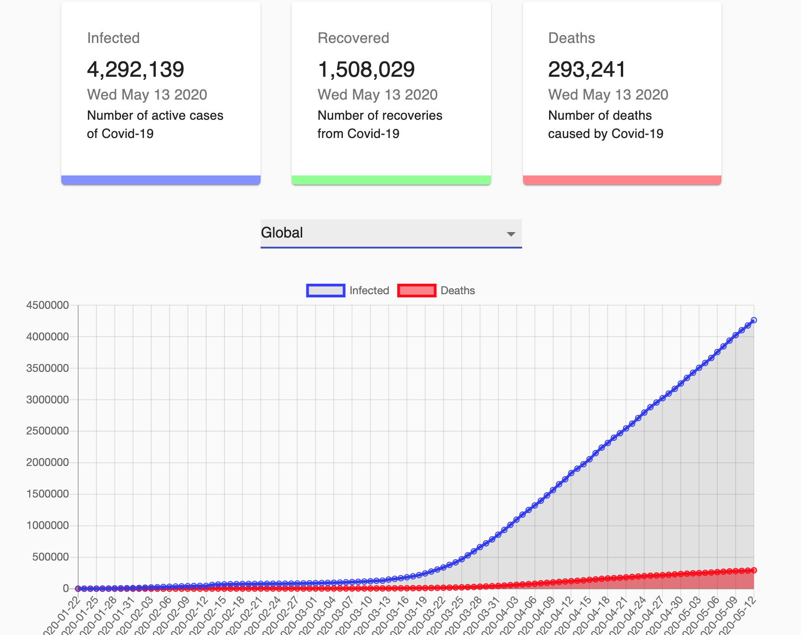

  

<h1 align="center">
  COVID-19 Visualizer🦠
</h1>

## COVID-19 Visualizer🦠
  

### covid19.mathdroのAPIから情報を取得し、グラフ化して整理して表示するアプリ
### 1. デフォルト時
- 感染者数,回復者数,死者数の合計をカード表示  
- 感染者数と死者数の推移を線グラフで表示 (2020.01.22~)

### 2. 国を選択時(188カ国から選択可)  
- 選択国の感染者数,回復者数,死者数の合計をカード表示 
- 選択国の感染者数合計,回復者数合計,死者数合計を棒グラフで表示

## 🧐 使用技術
  - HTML / CSS (Material-UI)
  - Typescript
  - React, React hooks

## 📚 他のプロジェクト
  - [Vocamy🥑](https://github.com/hiropalla1692/vocamy)
  - [Instant URL Sender 📩](https://abc.xyz)
  - [My Portfolio ☕️](https://github.com/hiropalla1692/my-portfolio)

## 📩 Contact
- [Mail](mailto:hirokuni0719@gmail.com)
- [Github](https://github.com/hiropalla1692/)
- [Wantedly](https://www.wantedly.com/users/82225561)
